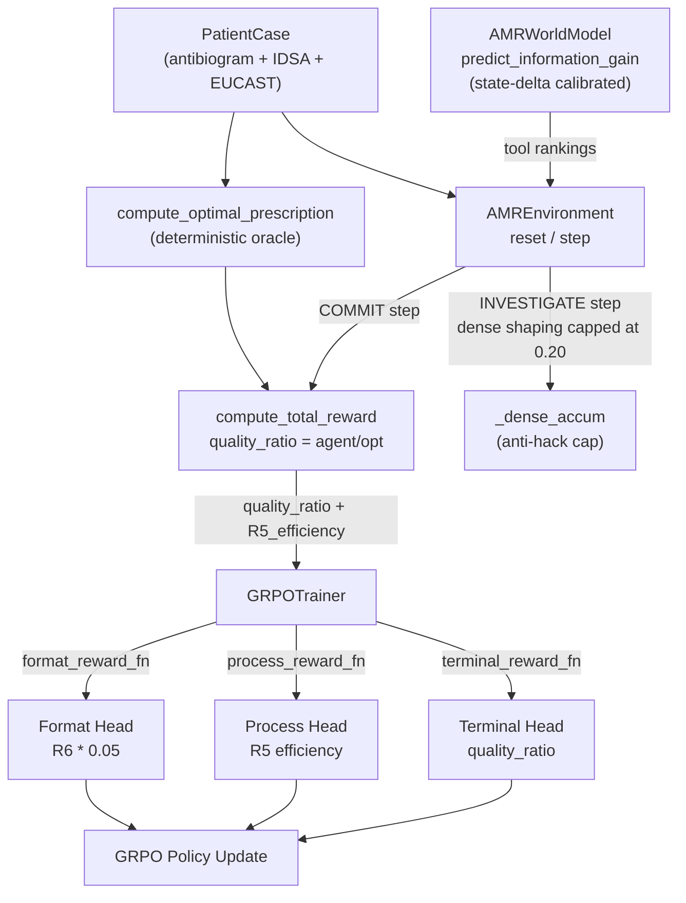

# AMR Mathematical Uplift Plan

## What the competitor is doing that you are not

metascaler-hack's core advantage is three interlocking ideas:

1. **Verifiable terminal reward** — `min(1, opt/agent)` using a MILP oracle as ground truth. Judges can independently verify the score.
2. **Capped dense shaping** — small per-step rewards up to a hard cap (0.4), so the terminal signal always dominates. Prevents reward hacking.
3. **Multi-head GRPO** — three separate reward functions (`cumulative`, `schema`, `terminal`) give the trainer richer gradient signal.

You have a neural world model (JEPA) they don't. That's your differentiator. The plan below makes your reward structure as rigorous as theirs while keeping JEPA central.

---

## Change 1 — Optimality-Ratio Terminal Reward (highest priority)

**Why:** AMR prescribing has a computable optimal answer. Given the patient's antibiogram, EUCAST breakpoints, and IDSA guidelines, there is exactly one prescription that maximizes R1+R2+R3+R4 (ignoring R5 which rewards process, not outcome). This makes your env RLVR-compliant — judges can verify the ground truth.

**Math:**

Add `compute_optimal_prescription(patient, eucast, idsa, drug_properties)` to [`env/reward.py`](env/reward.py). It iterates all susceptible drugs from the antibiogram, scores each with R1+R2+R3+R4, returns the maximum score as `opt_score`.

Replace the raw total in `compute_total_reward` with:

```
process_score  = 0.4*R1 + 0.25*R2 + 0.15*R3 + 0.1*R4   # outcome quality (no R5)
quality_ratio  = min(1.0, process_score / opt_score)       # vs optimal
final_total    = 0.9 * quality_ratio + 0.1 * R5            # R5 still rewards investigation
```

`quality_ratio = 1.0` means the agent found the best possible prescription. This is the AMR equivalent of `min(1, opt/agent)`.

**Files:** [`env/reward.py`](env/reward.py)

---

## Change 2 — Capped Dense Shaping for INVESTIGATE Steps

**Why:** Currently INVESTIGATE always returns 0.0 reward (or -0.1 on budget exhaustion). The agent gets no gradient signal during the investigation phase — only at COMMIT. This makes learning hard.

**Math:**

In [`env/environment.py`](env/environment.py), maintain `self._dense_accum = 0.0` per episode. Per INVESTIGATE step:

```
DENSE_NOVEL_TOOL  = +0.04  (tool type not yet called this episode)
DENSE_REPEAT_TOOL = +0.00  (same tool+arg called before)
DENSE_CAP         = 0.20   (hard cap; terminal reward for good prescription ~0.8+)
```

Formula:
```python
if tool_key not in self._called_tools:
    inc = min(DENSE_NOVEL_TOOL, DENSE_CAP - self._dense_accum)
    self._dense_accum += inc
    step_reward = inc
else:
    step_reward = 0.0
self._called_tools.add(tool_key)
```

The cap (0.20) is intentionally below the terminal reward for a correct prescription (~0.72–0.90), so shaped rewards never dominate. Prevents tool-call farming.

**Files:** [`env/environment.py`](env/environment.py)

---

## Change 3 — R5 Rewrite: Tool Efficiency Score

**Why:** Current R5 is keyword heuristics on concatenated tool text. It is not a reliable signal — a model can score R5=1.0 by including keywords in a hallucinated tool call.

**Math:**

```
unique_tools   = |{tool_name : tool_name in history}|
budget_total   = initial_budget (by curriculum level)
budget_spent   = budget_total - budget_remaining

R5_efficiency  = (unique_tools / max(1, budget_spent)) * (budget_remaining / budget_total)
```

- Rewards diversity of tool use (not repetition)
- Rewards committing with budget left (investigation stewardship, mirrors antibiotic stewardship)
- Returns 0.0 if agent commits without any investigation
- Returns 1.0 only if agent used all unique tool types and committed with full budget remaining (edge case, impossible — good)
- No keywords, no text parsing — computable from structured history

**Files:** [`env/reward.py`](env/reward.py), [`env/environment.py`](env/environment.py) (pass `budget_remaining` and `unique_tools` to R5)

---

## Change 4 — Multi-Head GRPO Reward Functions

**Why:** Competitor passes 3 reward functions to `GRPOTrainer`. You pass 1. Three functions give the trainer independent gradient channels: one for format compliance (fast feedback), one for investigation quality (dense), one for outcome quality (sparse terminal).

**Structure in [`train.py`](train.py):**

```python
# fn1: fast format signal
def format_reward_fn(prompts, completions, **kwargs) -> list[float]:
    return [float(R6_format(c)) * 0.05 for c in completions]

# fn2: investigation quality (unique tools used)
def process_reward_fn(prompts, completions, patient_json, **kwargs) -> list[float]:
    # parse tool calls from completion, score R5_efficiency
    ...

# fn3: outcome quality ratio (terminal)
def terminal_reward_fn(prompts, completions, patient_json, **kwargs) -> list[float]:
    # parse prescription, compute quality_ratio
    ...

trainer = GRPOTrainer(
    model=model,
    reward_funcs=[format_reward_fn, process_reward_fn, terminal_reward_fn],
    ...
)
```

**Files:** [`train.py`](train.py)

---

## Change 5 — JEPA Information Gain: State-Delta Metric

**Why:** Current metric is `1 - cos_sim(pred_next, ctx_current)`. This measures divergence of the predicted future from the present — but it's comparing apples (predicted post-tool) to oranges (current context). A model with random weights will still give a high divergence, which is meaningless.

**Better math:**

After an INVESTIGATE call fills in MIC/resistance data, the state vector changes. Use L2 norm of the actual state delta as the ground-truth information gain for JEPA pretraining supervision:

```
actual_gain(tool) = ||encode_known_state(state_after) - encode_known_state(state_before)|| / sqrt(dim)
```

During JEPA pretraining in [`jepa_pretrain.py`](jepa_pretrain.py), supervise the predictor to predict `actual_gain` (scalar), not just the next representation vector. This makes the world model's outputs interpretable and directly maps to "how much of the unknown will this tool reveal."

At inference in [`env/world_model.py`](env/world_model.py), the `predict_information_gain` output is now calibrated against actual state changes rather than arbitrary cosine divergence.

**Files:** [`env/world_model.py`](env/world_model.py), [`jepa_pretrain.py`](jepa_pretrain.py)

---

## Change 6 — Critical Bug Fixes (do first, not last)

Three verified bugs that will cause runtime failures:

- **`dict(CURRICULUM)[args.stage]` in [`train.py`](train.py) line 304**: `CURRICULUM = [(512,1),(512,2),(256,3)]` → `dict(CURRICULUM)` is `{512: 2, 256: 3}` (key collision). Indexing by stage 1/2/3 will `KeyError`. Fix: `CURRICULUM[args.stage - 1][0]`.

- **`reward_range: [0.0, 1.0]` in [`openenv.yaml`](openenv.yaml)**: Budget exhaustion returns -0.1, violating the declared range. Fix either by changing the range to `[-0.1, 1.0]` or converting the penalty to 0.0 reward + done=True.

- **R2 / `check_guideline` key mismatch**: `R2_guideline_concordance` uses `_organism_to_idsa_key` while `check_guideline` in the env uses a different matching logic. A prescription can score R2=0 in reward but show a guideline match in the tool result — the agent gets contradictory signals. Fix: make both use the same key resolution function.

**Files:** [`train.py`](train.py), [`openenv.yaml`](openenv.yaml), [`env/reward.py`](env/reward.py), [`env/environment.py`](env/environment.py)

---

## Change 7 — eval.py + viz.py (for demo evidence)

**Why:** Competitor has `eval.py` that runs multiple baseline policies and `viz.py` that plots gap histograms and reward curves. Judges want to see training curves and comparison evidence. You have `log_history.json` saved but no way to plot it.

**Add `eval.py`:**
- `GreedyPolicy`: always picks first susceptible IDSA first-line drug, no investigation
- `RandomPolicy`: random valid prescriptions
- `TrainedPolicy`: loads checkpoint, generates completions
- Reports: `mean_quality_ratio`, `improvement_over_greedy`, per-component reward averages

**Add `viz.py` (or `plot_rewards.py`):**
- Reads `checkpoints/amr-grpo/stage*/log_history.json`
- Plots per-stage reward curves (total + per-component breakdown)
- Plots quality_ratio distribution histogram
- Output: PNG files for README / HF Space

**Files:** New `eval.py`, new `viz.py`

---

## Priority order

- **Do first (bugs + highest ROI):** Changes 6, 1, 4
- **Do second (mathematical rigor):** Changes 2, 3
- **Do last (JEPA depth):** Changes 5, 7

---

## Architecture after changes


